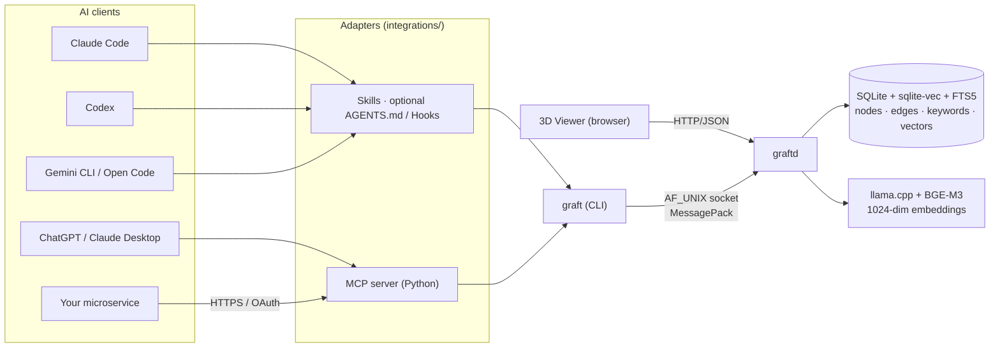

<div align="center">


<h1>graft</h1>

<p><strong>Local-first agentic memory for AI coding agents.</strong><br/>
Stop solving the same problems twice. Give Claude Code, Codex and any other agent a persistent memory<br/>
that survives sessions, context resets and machine switches — locally, with no cloud and no API key.</p>

<sub>C11 · SQLite + sqlite-vec + FTS5 · llama.cpp + BGE-M3 · MessagePack · AF_UNIX socket · optional REST + 3D viewer</sub>

<br/><br/>

[](./LICENSE)
[](#project-status)
[](./docs/install/)
[](./docs/install/)
[](./docs/profiles/)
[](./docs/)

<br/>

<sub>Made for Claude Code · Codex · ChatGPT · Claude Desktop · Gemini CLI · Open Code · and your own microservices.</sub>

</div>

---

## Why Graft?

AI coding agents are productive — but they forget everything when the session ends.

They forget:
- the root cause of that bug you debugged for three hours last week
- the architectural decision you made and _why_ you made it
- the Spring / Angular / Docker gotcha that bit you twice
- project-specific conventions that aren't in any README
- the dependency constraint that rules out a whole class of solutions

Every session starts from zero. Every fixed bug risks being re-debugged. Every decision risks being re-debated.

**Graft turns hard-won agent reasoning into reusable agentic memory.**

It is not a vector database, a RAG framework, or a chatbot platform. It is the smallest useful thing that makes your agent's knowledge survive its session — local-first, no SaaS, no API key, one binary, one SQLite file.

---

## Agentic memory, not a vector DB

Graft is shaped around how an **agent** writes and reads notes about its own work — not around how an application indexes a document corpus.

| Vector DB / RAG store          | Graft (agentic memory)                                     |
| ------------------------------ | ---------------------------------------------------------- |
| Index documents you already have | Capture decisions, gotchas, and root causes as an agent solves them |
| Query → top-k chunks            | Query → verified `STRONG` / `WEAK` / `MISS` with a single best answer |
| You decide what to ingest       | The agent decides what is worth remembering, in-loop       |
| Stateless reads                 | Edges + supersession track how knowledge evolves           |
| Library / managed service       | Local binary, single SQLite file, no SDK to bind to        |

If you need a vector DB, use a vector DB. Graft is for the layer above: **persistent reasoning the agent can build on**, not a search index over your files.

---

## Install in 30 seconds

```bash
brew tap nanonets/graft https://github.com/NanoNets/Graft.git
brew install graft
graft stats
```

That's it. No daemon to start. No model to download by hand. No config to write.

> Not on macOS / Linux Homebrew? Run the cross-platform installer:
>
> ```bash
> git clone https://github.com/nanonets/graft.git && cd graft
> bash scripts/install.sh         # Linux, macOS, Windows MSYS2
> pwsh scripts/install.ps1        # Windows (auto-installs MSYS2 if needed)
> ```
>
> Optional GPU acceleration: `GRAFT_GPU=cuda bash scripts/install.sh` (NVIDIA CUDA) or `GRAFT_GPU=hip bash scripts/install.sh` (AMD ROCm 6 / 7). Builds are kept lightweight so contributors can iterate without long compile cycles.

Full installation reference: [`docs/install/`](./docs/install/).

---

## See it in action — 60 seconds

```console
$ graft query "spring boot validation cascade nested DTO"
{ "status": 0, "result": { "hit": "MISS" } }

# ... you debug the issue, find the answer ...

$ graft insert \
    --title "Spring Boot @Valid cascade on nested DTOs needs @Valid on the field plus @Validated on the controller" \
    --body  "Without @Valid on the nested field, constraints inside it are silently ignored. Tested on Spring Boot 3.2; matches the Jakarta Validation spec." \
    --keyword spring-boot --keyword validation --keyword gotcha
{ "status": 0, "result": { "id_hex": "019e09a95e7a...", "duplicate": false } }

# ... weeks later, on another machine, in another agent ...

$ graft query "why is my @Valid annotation not cascading on a nested DTO field"
{
  "status": 0,
  "result": {
    "hit":   "STRONG",
    "title": "Spring Boot @Valid cascade on nested DTOs needs @Valid on the field plus @Validated on the controller",
    "body":  "Without @Valid on the nested field, constraints inside it are silently ignored. ..."
  }
}
```

The two queries used **different phrasing**. The match is semantic plus lexical, gated by a verify step that **refuses to claim a hit when the signals are weak** — so your agent never quotes confidently-wrong answers.

---

## What you get

Each capability is labelled by maturity: **Stable** = shipped and used by the integrations; **Experimental** = wired up but rough edges or no benchmarks; **Vision** = a future direction, partially scaffolded at most.

<table>
<tr>
<td width="33%" valign="top">

#### Cache-first retrieval · *Stable*
`graft query <text>` returns `STRONG` / `WEAK` / `MISS`. STRONG injects title + body straight into the agent's context, so the agent does not have to choose between a list of candidates.

</td>
<td width="33%" valign="top">

#### Hybrid search · *Stable*
`graft retrieve` fuses dense (BGE-M3 cosine) and lexical (BM25 over title and body) via Reciprocal Rank Fusion.

</td>
<td width="33%" valign="top">

#### Graph walks · *Stable*
`graft explore` follows keyword and semantic edges with beam search and MMR diversity, decay `gamma^step`.

</td>
</tr>
<tr>
<td valign="top">

#### Multi-tenant profiles · *Stable*
Isolated DBs and sockets per profile (`work`, `personal`, project-scoped).
Import / export / merge as plain SQLite files.

</td>
<td valign="top">

#### Local-first · *Stable*
Single binary, single DB file, no network.
Models run on CPU out of the box; opt-in to CUDA or ROCm 6 / 7 with a build flag.

</td>
<td valign="top">

#### Optional REST + 3D viewer · *Experimental*
Flip a flag in `config.yaml`, get JSON endpoints and a browser-based graph explorer with click-to-edit (atomic supersession). API surface still evolving.

</td>
</tr>
<tr>
<td valign="top">

#### Agent integrations · *Stable*
Claude Code, Codex, and Open Code skills via `graft setup`; Claude Desktop / ChatGPT via MCP; Gemini CLI via `GEMINI.md`.

</td>
<td valign="top">

#### Microservice cache pattern · *Experimental*
Design pattern: <b>L1 Redis</b> + <b>L2 graft semantic cache</b> + <b>L3 graft + LLM</b>. Reference docs, no published benchmarks. [See the pattern](./docs/microservices/).

</td>
<td valign="top">

#### Remote / team memory · *Vision*
A shared memory store across machines or teammates is a planned direction, not a shipped feature. Today: per-machine local profiles, plus export / import / merge as SQLite files.

</td>
</tr>
</table>

---

## Core concepts

| Term | What it means |
| ---- | ------------- |
| **Memory node** | A `title` (retrieval anchor) + `body` (full context) + keywords. The unit graft stores and retrieves. |
| **Profile** | An isolated memory space with its own DB and daemon. Switch with `GRAFT_PROFILE=name`. |
| **Semantic cache** | `graft query` — verified top-1 lookup. Returns STRONG, WEAK or MISS. No hallucinated hits. |
| **Graph edge** | Keyword or semantic link between nodes. Enables `graft explore` to walk connected knowledge. |
| **Supersession** | Replacing an outdated node while keeping the old one visible as `SUPERSEDED`. History stays, mistakes don't propagate. |
| **Confidence** | STRONG = both semantic similarity and lexical overlap pass the verify gate. WEAK = semantic signal only. |

Full glossary → [`docs/concepts.md`](./docs/concepts.md).

---

## Built for AI development tools

```text
┌─────────────────────────────┐    ┌─────────────────────────────┐
│ LLM chat clients            │    │ Coding agents (CLI-based)   │
│ Claude Desktop · ChatGPT    │    │ Claude Code · Codex · ...   │
└──────────────┬──────────────┘    └──────────────┬──────────────┘
               │ MCP (stdio or HTTPS)             │ subprocess
               ▼                                  ▼
┌─────────────────────────────┐    ┌─────────────────────────────┐
│ integrations/mcp-server/    │    │ graft CLI                   │
│  · server.py  (stdio)       │───▶│  → unix socket              │
│  · oauth_gateway.py (HTTP)  │    │                             │
└─────────────────────────────┘    └──────────────┬──────────────┘
                                                  ▼
                                     ┌─────────────────────────────┐
                                     │ graftd (daemon)             │
                                     │  SQLite + sqlite-vec + FTS5 │
                                     │  + BGE-M3 (llama.cpp)       │
                                     └─────────────────────────────┘
```

| Agent          | Integration               | Setup |
| -------------- | ------------------------- | ----- |
| Claude Code    | Skills                    | `graft setup claudecode` |
| Codex          | Skills                    | `graft setup codex` |
| Claude Desktop | MCP server (stdio)        | `integrations/claude-ai/claude_desktop_config.json` |
| ChatGPT        | MCP server (stdio or HTTP)| `integrations/chatgpt/mcp_config.json` |
| Gemini CLI     | `GEMINI.md` memory file   | `integrations/gemini-cli/` |
| Open Code      | Skills                    | `graft setup opencode` |

Each adapter ships **skills** that tell the model *when* to search and *when* to save. Hook and agent-instruction installers are currently kept out of `graft setup`; use the integration docs for manual wiring if needed.

Full integration matrix and setup: **[`docs/integrations/`](./docs/integrations/)**.

---

## Beyond agent tooling — a microservice cache pattern *(experimental)*

The same primitives that serve an agent (verified semantic cache + write-back) also slot in front of an LLM in a microservice. The pattern below is **a recommended design, not a benchmarked production stack** — share it with a back-end team that wants fewer LLM calls and is willing to validate it on their own workload:

```text
                       ┌──────────────────────────────┐
        ┌────────────► │  L1 — Redis                  │  exact key match
        │              │  cache:<sha256(prompt)>      │
        │              └──────────────┬───────────────┘
        │                  MISS       │
        │                             ▼
  Client                 ┌──────────────────────────────┐
   request ─────────────►│  L2 — graft semantic cache   │  paraphrase-aware,
        ▲                │  GET /v1/match?text=...      │  verified STRONG/WEAK/MISS
        │                └──────────────┬───────────────┘
        │                    MISS       │
        │                               ▼
        │                 ┌──────────────────────────────┐
        │                 │  L3 — graft + LLM            │  top-k retrieve +
        │                 │  GET /v1/search → LLM        │  LLM synthesis
        │                 │  POST /v1/insert (writeback) │  writeback for next time
        └─────────────────└──────────────────────────────┘
```

| Layer | What it answers | Cost shape |
| ----- | --------------- | ---------- |
| **L1** Redis              | "Have we seen *this exact prompt* before?"           | RAM bytes |
| **L2** graft semantic     | "Have we seen *a question that means this* before?"  | local CPU |
| **L3** graft + LLM        | "We haven't. Let me reason from related memories."   | LLM tokens |

The idea: L3 answers get written back through `POST /v1/insert`, so the next caller hits L2 instead of regenerating with the LLM. Real savings depend entirely on your traffic — there are no published benchmarks yet.

Full pattern, sample code, deployment shapes, and failure modes: **[`docs/microservices/`](./docs/microservices/)**.

---

## Try it now — a real round-trip

```bash
graft insert \
  --title "First memory" \
  --body  "If this is retrievable below, graft is wired correctly." \
  --keyword smoke-test

graft query "the very first thing I saved"
# → "hit": "STRONG" + the body you just inserted
```

If you see `"hit": "STRONG"`, your pipeline is healthy: BGE-M3 embedding ↔ `sqlite-vec` vector index ↔ FTS5 lexical ↔ multi-signal verifier are all talking to each other.

---

## Architecture in one diagram



Pipelines:

- **insert** — `embed(title)` → upsert keywords → `vector_topk` per keyword (KEYWORD edges) → `vector_topk + MMR` (SEMANTIC edges) → **one atomic SQLite transaction**.
- **query** — `embed(text)` → `vector_topk(10)` → trigram-Jaccard + cosine (+ optional cross-encoder) verify → STRONG / WEAK / MISS gating.
- **retrieve** — three lists (vec, BM25 title, BM25 body) → RRF fusion → top-k.
- **explore** — seed via `vector_topk` filtered by keyword → beam search with MMR + decay `gamma^step`.

Full architecture: [`docs/architecture/`](./docs/architecture/).

---

## Documentation

Everything is broken down by feature. Each page ends with a **"What's missing and how to improve it"** section — pick one and open a PR.

| Folder | What's inside |
| ------ | ------------- |
| [`concepts.md`](./docs/concepts.md)             | Glossary: node, profile, semantic cache, edge, supersession, confidence. |
| [`use-cases.md`](./docs/use-cases.md)           | Concrete scenarios: coding agent memory, bug fix reuse, project decisions, team memory. |
| [`install/`](./docs/install/)                   | Homebrew, install scripts, manual build, GPU builds, first-run check. |
| [`release/`](./docs/release/)                   | Versioning, GitHub Releases, signed assets, SBOM, `graft upgrade`. |
| [`architecture/`](./docs/architecture/)         | CLI ↔ daemon split, wire protocol, request lifecycle. |
| [`cli/`](./docs/cli/)                           | Every `graft` / `graftd` subcommand and flag. |
| [`storage/`](./docs/storage/)                   | SQLite schema, sqlite-vec, FTS5, atomic supersession, idempotency, WAL. |
| [`embeddings/`](./docs/embeddings/)             | BGE-M3 (1024-dim), llama.cpp, CPU vs CUDA vs ROCm. |
| [`retrieval/`](./docs/retrieval/)               | `query` (cache), `retrieve` (RRF), `explore` (beam + MMR), the verify pipeline. |
| [`insert/`](./docs/insert/)                     | Insert pipeline, keyword / semantic edges, MMR diversity, content hashing, `classify`. |
| [`profiles/`](./docs/profiles/)                 | Multi-tenancy, per-profile DB + socket + daemon, export / import / merge / remote sync. |
| [`http-api/`](./docs/http-api/)                 | Optional REST layer, per-endpoint flags, examples. |
| [`viewer/`](./docs/viewer/)                     | Browser 3D viewer (Vue + three.js + CodeMirror), modes, edit-with-supersession. |
| [`integrations/`](./docs/integrations/)         | Per-agent adapters + MCP gateway. |
| [`microservices/`](./docs/microservices/)       | The L1 Redis + L2 graft + L3 graft + AI stack. |
| [`maintenance/`](./docs/maintenance/)           | `stats`, `consolidate`, usage log, `analytics`. |
| [`configuration/`](./docs/configuration/)       | Every key in `config.yaml`, every recognised environment variable. |

The full index lives at **[`docs/`](./docs/)**.

---

## Why graft, not _other-thing_?

Plenty of agent-memory projects exist (mem0, Letta, Zep, Cognee, Graphiti, ...). They're libraries you import into a Python app, or services you self-host with a database. Graft picks a different shape:

- **A binary, not a library.** The CLI is the contract. Any agent that can run a subprocess can use it — no Python runtime, no SDK version drift between client and server.
- **Daemon + AF_UNIX socket.** State lives in one process; the CLI is a thin client. The first call pays a one-off model-load cost; subsequent calls reuse the warm daemon.
- **Multi-agent by design.** Claude Code, Codex, ChatGPT, and Claude Desktop already share the same graph on this machine — different surfaces, one memory.
- **Local-first, no managed service.** SQLite on disk, llama.cpp for embeddings, no telemetry, no account. Backups are `cp graft.db dest/`.
- **Cache-first, then retrieve.** Most reads are answered by a verified top-1 cache lookup, not a top-k semantic spray. Lower latency, less context noise, fewer hallucinations.

---

## Project status

Graft is in **active alpha** — suitable for local single-user agent workflows and experimentation. Team / multi-user scenarios are a future direction, not a shipped capability.

The storage model, retrieval pipeline, and CLI surface are working and stable enough that the shipped integrations rely on them. APIs and internal storage format may still change before 1.0.

Honest disclosures:
- The **cross-encoder reranker** is a stub (`mg_ce_score_pair` returns `-1`). Today the verify gate uses trigram-Jaccard + cosine, which is plenty for most corpora. Wiring BGE-reranker-v2-m3 is on the roadmap.
- **API contract**: the CLI JSON schema is the public surface. Internal C APIs may change without notice.
- **Prebuilt alpha releases** are now published through GitHub Actions with test gating, SHA256 checksums, SBOM, Sigstore/cosign signatures and build provenance. Source builds remain the fallback while packaging and platform coverage stabilize.

---

## Roadmap

### Now
- Stabilise CLI commands and JSON output schema
- Improve local agent memory workflows (Claude Code, Codex)
- Publish first signed GitHub Release with SBOM, checksums, and platform archives
- Add richer usage examples and benchmarks

### Next
- Cross-encoder neural reranker (BGE-reranker-v2-m3) via `verification.cross_encoder_enabled`
- NLI for contradiction detection → `MG_EDGE_CONTRADICTS` edges
- Adaptive threshold calibration driven by `stats`
- Remote read-only profiles (share a memory store across machines)
- Importable thematic memory packs (postmortems, decision frameworks, ...)

### Later
- Real content `consolidate` (dedup similar nodes, supersede stale ones by similarity)
- Team / shared memory server
- Distributed profile sync
- Observability and admin tooling

---

## Contributing

```bash
# 1. clone, install, smoke-test
git clone https://github.com/nanonets/graft.git && cd graft
bash scripts/install.sh
graft stats

# 2. find something to do
#    every docs page ends with "What's missing and how to improve it"

# 3. branch from master, keep PRs focused
```

Builds are kept lightweight so contributors can iterate quickly. Tests run with `cmake --build build --target test`. Pre-commit hook for Conventional Commits is installed automatically by `scripts/install.sh`.

Bug reports and feature ideas: [GitHub Issues](https://github.com/nanonets/graft/issues). Read [CONTRIBUTING.md](./CONTRIBUTING.md) for the short version.

---

## License

[Apache License 2.0](./LICENSE). You can use, modify, distribute, and embed graft in proprietary projects, including commercially, provided you keep the copyright and licence notices and document any changes you make to the source files.

<div align="center">

<br/>
<sub>Built in C11. Local-first. No SaaS. No API key.<br/>
<a href="./docs/">docs</a> · <a href="./docs/install/">install</a> · <a href="./docs/use-cases.md">use cases</a> · <a href="./docs/concepts.md">concepts</a> · <a href="./docs/microservices/">microservices pattern</a> · <a href="https://github.com/nanonets/graft/issues">issues</a></sub>
<br/><br/>

</div>
