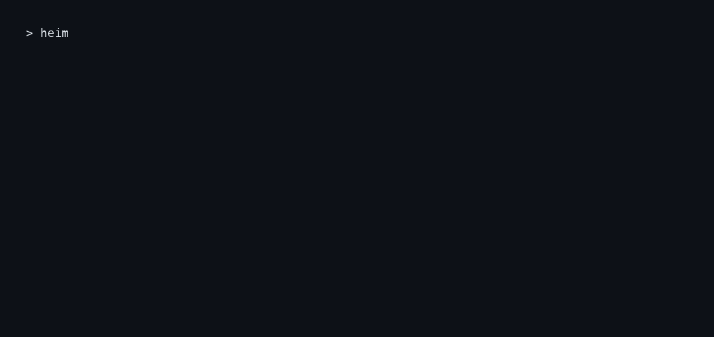

# Heimdall

<p align="center">
  <a href="https://www.npmjs.com/package/@arihantdeva/heimdall"></a>
  <a href="https://github.com/ArihantDeva/heimdall/actions/workflows/ci.yml"></a>
  <a href="https://github.com/ArihantDeva/heimdall/stargazers"></a>
  
</p>

**Your agent keeps rebuilding work you already did. Heimdall makes it stop.**

Heimdall gives AI coding agents **persistent memory across every repository and project you work on** — so the question *"did I already solve this in another project?"* gets answered by one verified search instead of twenty minutes of grep, `find`, and `ls` loops.

## The problem it solves

**1. Memory that doesn't live in one repo.** Every other memory tool is per-project. But your work isn't: the Excel tracker pattern you built last month solves the CSV-parsing problem in today's repo. Heimdall indexes *everything you touch* into one semantic graph, so knowledge follows you across repositories, languages, and months.

**2. Orientation time, cut to seconds.** A fresh agent session burns dozens of bash commands just figuring out the lay of the land — `ls`, `grep`, re-reading files it read last week. Heimdall injects the relevant prior work into the session's first prompt and backs a single `kb_search` call: ranked, scoped, verified. Fewer commands, fewer tokens, faster first useful action.

**3. Zero token spend, zero GPU.** Memory maintenance is a local daemon: file watching, tree-sitter AST parsing, sqlite. Indexing a file costs **CPU only — never an LLM call**. Retrieval is hybrid ranked search (lexical + semantic + graph walk) over locally-computed embeddings. Your context window stays for your actual work.

**4. Retrieval you can act on.** Semantic memory tools return plausible matches; Heimdall re-verifies every hit against the filesystem at query time and labels it:

- `STRONG` — path exists on disk, strong lexical coverage, **and** the file's actual content answers the query (content-aware scoring)
- `WEAK` — semantic match only; plausible but unverified
- `REBUILT` — file moved; Heimdall found it and re-anchored automatically
- `STALE` / `REMOVED` — dead path, logged and pruned so it stops ranking

An agent acting on a dead path is worse than no answer. Verdicts are what make the graph trustworthy enough to act on.

## How a session changes

Without Heimdall:

```
$ grep -r "portfolio optimization" .            # wrong repo, 40s
$ find ~/Repos -name "*.py" | xargs grep -l jam_opt   # 2 min
$ ls ~/Desktop/... ; cat notes.md ; ...         # 15 commands later
```

With Heimdall:

```
$ kb_search "portfolio optimization jam optimizer"
   1. [STRONG] poker jam_opt optimizer — ~/Repos/poker-bot/tools — heads-up jam/fold EV optimizer
   2. [STRONG] TypeE excel build — ~/Desktop/Shepherd Ventures/MVO2 — 276-session tracking table
```

One call. Verified paths. Straight to work.

## How it compares

| **Heimdall** | mem0 | Claude Memory | Letta (MemGPT) | cAST / grep |
|---|---|---|---|---|
| Scope | **All your repos, one graph** | per-app/per-user | per-conversation/account | per-agent | per-repo |
| Runs on CPU only | **yes** | cloud or self-host | cloud | self-host | yes |
| Token cost of indexing | **zero** (tree-sitter + local embeddings) | LLM extraction | LLM summarization | LLM | zero but manual |
| Trust verdicts on results | **STRONG / WEAK / REBUILT / STALE** | none | none | none | none |
| Self-healing (moved files re-anchored) | **yes** | no | no | no | no |
| Harness integrations | pi, Claude Code, Codex, Cursor, Windsurf | SDK/API | Claude products | SDK/API | editor plugins |
| Local-first, your data stays home | **yes** | optional | no | yes | yes |

Heimdall is the only one built for the actual workflow: many repos, many months, one agent session at a time, on hardware you already own.

## FAQ

**Does my code leave my machine?** No. Indexing is tree-sitter parsing + local embeddings on CPU. Search runs against your local daemon. Nothing phones home.

**Do I need a GPU?** No. The embedding model (bge-m3) runs on Apple Silicon / any modern CPU.

**How is this different from grep?** Grep finds strings you already know exist. Heimdall answers "have I solved anything like this before?" across every project you've touched, ranked and verified against what's actually on disk right now.

**What if a file moves or gets deleted?** The reconciler notices on its next pass. Moved files are re-homed automatically (REBUILT verdict); deletions retract exactly their own nodes. A stale path never ranks again.

**Does it work with my agent?** One command wires it into pi, Claude Code, Codex, Cursor, or Windsurf. Anything that can run a CLI can use `search`/`insert` directly.

**Is it production-ready?** It runs daily on this author's machine across ~12,800 live nodes with a 166-test suite guarding the concurrency invariants. v0.2.0. LongMemEval benchmark harness is in `bench/` (in progress).

## Roadmap

- [x] v0.1 — packaged CLI, five harness adapters, trust verdicts
- [x] v0.2 — single-writer reconciler, depth-ladder indexing (symbols + call edges)
- [ ] LongMemEval-S score ≥ 0.90 published from `bench/` (baseline S 0.740 reproduced)
- [ ] One-command graft backend install (`heimdall init --backend`)
- [ ] Linux daemon packaging
- [ ] MCP server mode

## Contributing

PRs welcome — see [CONTRIBUTING.md](CONTRIBUTING.md). The concurrency invariants are tested; break them and the suite goes red before you do.

## Quickstart

```bash
npm i -g @arihantdeva/heimdall
heimdall init --harness claude-code   # or pi | codex | cursor | windsurf | all
```

That's it for install + harness wiring (`init`, `insert` work immediately).

Ranked search and `doctor` need the [graft backend](https://github.com/NanoNets/Graft) — one extra step:

```bash
# build graft from source, put the binary on PATH, then:
cp "$(npm root -g)/@arihantdeva/heimdall/config/heimdall.yaml.example" ~/.graft/config.yaml
heimdall doctor                        # should print HEALTHY
heimdall search "excel tracker portfolio optimization"
```

On macOS the backend runs as the launchd job `com.graft.daemon` (template: `launchd/com.heimdall.backend.plist.example`).

## Demo



Real session output (abridged):

```
$ kb_search "portfolio optimization jam optimizer"
== retrieve (hybrid ranked): portfolio optimization jam optimizer
   1. [STRONG] cov83%  poker jam_opt optimizer — ~/Repos/poker-bot/tools
      heads-up jam/fold EV optimizer, edited 2026-08-14
   2. [WEAK]   TypeE excel build — ~/Desktop/Shepherd Ventures/MVO2
```

Every hit carries a trust verdict computed against the live filesystem — not a cached embedding score.

## Design history

v0.1.0 hooks inferred graph mutations by regex-parsing bash commands and writing the graph from every hook process. It collapsed: writes it didn't recognize were invisible, concurrent hook processes raced delete+insert, and a misparse wrote wrong data as fact. v0.2.0 replaced all of it with a **single-writer, level-triggered reconciler**: nothing ever tells the graph *what* changed, only *that a path might have*. The reconciler reads the file from disk and makes the graph match.

The trust verdict layer came from the same lesson one level up: even a perfect graph lies if its anchors rot (directories get reorganized aggressively). So search results are re-verified against the filesystem at query time, with self-healing (rehome) for moved files.

## Star History

[](https://star-history.com/#ArihantDeva/heimdall&Date)

If Heimdall saved you a rebuild, a star helps other agents' humans find it.


## Architecture / how it works

```
                 ┌─────────────────────────── harness integrations ───────────────────────────┐
                 │  Pi: extensions/kb-*.ts          Claude Code: PostToolUse hook             │
                 │  (kb-tools, kb-autosync, kb-orient, kb-search-guard)   Codex/Cursor/Windsurf │
                 └───────────────┬──────────────────────────────┬─────────────────────────────┘
                                 │ only ever appends hints      │
                                 ▼                              ▼
                     ~/.heimdall/hints.jsonl        heimdall CLI (bin/heimdall.js)
                                 │                     init / insert / hint / verify / depth
                                 ▼                                    │
   ┌───────────────────────── THE SINGLE WRITER (holds O_EXCL lock) ───┘
   │  bin/heimdall-reconciler.mjs  (daemon: fs watch + hint ingest + drain loop + audit timer)
   │        │ drain()  reads hint queue → reconcilePath() per path
   │        ▼
   │  bin/lib/reconcile.mjs  — level-triggered convergence
   │        reads file from disk → desiredState() → compares hash/depth
   │        → sink projection (graft insert/delete) BEFORE journal commit
   │        → journal.commit() in one transaction, generation-guarded (ABA)
   │        ▼
   │  bin/lib/journal.mjs  — AUTHORITATIVE index (~/.heimdall/journal.db, node:sqlite, WAL)
   │        paths (hash/size/mtime/depth/generation/state) · owned_nodes · owned_edges
   │        pending_edges (order-independent cross-file edges) · queue (dedup)
   │        ▼
   └──────────►  bin/lib/sink.mjs  — projection target (pluggable backend)
                 GraftSink (graft CLI) | MemorySink (tests, --dry-run)
                 ▼
        ~/.graft daemon (vendor/graft, built from source) — sqlite + bge-m3 embeddings + graph edges

   SEARCH PATH (read side, no lock):
   kb-search.sh → graft retrieve (hybrid ranked) → kb_search_verify.py (verdicts + stale heal)
                → graft explore (graph walk of related work) → printed, ranked, verified
```

**Core invariants** (each has a test):

- **Level-triggered, not event-driven.** Hooks/watchers/scripts can only say "look at this path". They are never believed about *what* happened. A missed, duplicated, or flatly wrong hint costs one `stat` — nothing more. This is what makes 40 concurrent agents editing one file harmless: they produce N cheap appends that collapse to one queue row (primary-key dedup).
- **Single writer by construction.** Every graph/journal mutation passes through `Lock` — an `O_EXCL` create with stale-PID liveness reclamation (Node has no portable flock). Two writers cannot exist, so the old delete-then-insert race (file briefly vanished from the graph) is unrepresentable. The daemon holds the lock for its lifetime; one-shot `heimdall reconcile` takes it too and serializes against the daemon.
- **Exact ownership.** Every node and edge belongs to exactly one path. A commit deletes and re-inserts all of that path's rows in one transaction — a deleted symbol cannot survive as a ghost, and one path's retraction never touches another's rows.
- **Content hash is the oracle.** Desired state = pure function of (bytes, depth). Reconciling twice is byte-identical to reconciling once. The `generation` counter is the ABA guard: a commit whose generation moved since the reconcile started is rejected (action `stale`) and the path re-queued, so a late reconcile can never resurrect a node a newer one deleted.
- **Order independence.** A cross-file edge to a not-yet-indexed symbol parks as a pending edge, owned by the source file, and resolves in both directions once the target file reconciles. The final graph does not depend on which file was reconciled first.
- **Audit as backstop.** `heimdall verify` compares the journal against the filesystem (stat-only: size/mtime, plus a depth-upgrade check) and exits 1 on drift; `--deep` re-hashes everything and catches even a same-size/same-mtime rewrite. This is the accuracy claim as a CI-able command. The daemon runs the same audit on a timer (default 15 min) and re-queues drift.
- **Journal before sink, sink before commit.** Sink writes happen BEFORE the journal commit: a crash in between leaves the path dirty, so it is redone — safe because reconcile is idempotent. The reverse order could mark a path clean that was never projected, which is the one failure the audit cannot detect later.
- **The honest guarantee is bounded-staleness convergence**, not instantaneous correctness: between an edit and the next reconcile pass the graph is behind. It is never *wrong* in a way that survives a pass.

## Depth levels

Nodes are indexed at a depth. The default and the recommendation is **maximum** — the graph knows not just that a file exists but which functions and classes live in it, at which lines, and what calls what.

| Depth | Node knows |
|---|---|
| `path` (L0) | the file exists |
| `file` (L1) | + language, size, description |
| `symbol` (L2) | + one node per top-level definition, with `file:line` and signature |
| `graph` (L3) | + imports / calls / inherits / uses edges, intra- and cross-file |

`max` resolves to whatever the machine can actually do: L2/L3 need tree-sitter, so a box without it degrades to L1 rather than failing — and the next audit automatically re-indexes at the deeper level once tree-sitter appears (a depth upgrade shows up as drift). Asking for a depth above the machine's capability is honored as far as possible and reported as `clamped`:

```bash
heimdall depth src/server.ts         # requested vs effective depth for one path
```

Extraction is tree-sitter AST parsing via a Python bridge, **not an LLM call**: depth costs CPU, never tokens. The bridge (`bin/lib/heimdall_extract.py`) deliberately calls graphify's per-language extractors directly rather than `graphify.extract()`, because the latter writes a `graphify-out/cache/` directory next to the files it reads (Heimdall indexes the whole home tree) and adds a second cache with its own invalidation rules that could disagree with reality.

## Components (map)

| Component | File | Job |
|---|---|---|
| **CLI** | `bin/heimdall.js` + `bin/lib/cli-main.mjs` | `init` / `search` / `insert` / `doctor` / `daemon` / `reconcile` / `verify` / `depth` / `hint` — thin wrappers over the bin/ scripts, never a rewrite |
| **Reconciler daemon** | `bin/heimdall-reconciler.mjs` | the single writer: recursive fs watch + hint ingest + drain loop + audit timer, holds the lock for its lifetime |
| **Reconcile** | `bin/lib/reconcile.mjs` | level-triggered convergence: read disk, make graph match; `audit()` = drift detector |
| **Journal** | `bin/lib/journal.mjs` | authoritative index: ownership, hashes, generations, dedup queue, pending edges |
| **Extraction** | `bin/lib/extract.mjs` + `bin/lib/heimdall_extract.py` | desired state per file: hash + L0-L3 nodes/edges, path-namespaced node ids |
| **Depth ladder** | `bin/lib/depth.mjs` | levels, capability probe, per-root overrides, config |
| **Single-writer lock** | `bin/lib/lock.mjs` | `O_EXCL` lock every graph mutation passes through |
| **Hints** | `bin/lib/hints.mjs` | the one channel a non-writer may use (append-only, atomic, torn-line tolerant) |
| **Sink** | `bin/lib/sink.mjs` | projection targets: `GraftSink` (CLI) and `MemorySink` (tests/dry-run) |
| **Ranked search** | `bin/kb-search.sh` | top-k hybrid ranked + graph walk, `--scope` filter |
| **Trust verification** | `bin/kb_search_verify.py` | content-aware STRONG/WEAK/STALE/REBUILT/REMOVED verdicts; stale self-heal |
| **Stale pruning** | `bin/kb-stale-scan.py`, `bin/kb-rehome.sh` | full-graph sweep: deterministic rehome or log+delete |
| **Health & telemetry** | `bin/kb-health.sh`, `bin/telemetry.sh` | daemon health, index freshness, usage stats (kb_* calls/24h, hit rate, est. time saved) |
| **Bootstrap** | `bin/sync-edits.sh`, `bin/seed-graft.sh` | replay session edit logs → hints; seed inventory TSV into Graft |
| **Full rebuild** | `bin/kb-rebuild.sh` | backup → wipe → parallel restore → re-seed → prune → verify |
| **Pi extension: tools** | `extensions/kb-tools.ts` | exposes `kb_search` / `kb_insert` / `kb_sync` as agent tools |
| **Pi extension: autosync** | `extensions/kb-autosync.ts` | hook that appends path hints — never writes the graph |
| **Pi extension: orient** | `extensions/kb-orient.ts` | injects prior-work hits into the first user prompt of a session (2.5s cap, silent degrade) |
| **Pi extension: guard** | `extensions/kb-search-guard.ts` + `extensions/lib/kb-guard-core.mjs` | warns after 3 consecutive grep-style actions without kb_search |
| **Backends** | `vendor/graft/` (Apache 2.0), `vendor/graphify/` (MIT) | Graft = semantic-memory daemon; graphify = code-graph extractors |

**Backends are pluggable.** Any store speaking the graft CLI contract works; Graft is the vendored reference. See `docs/heimdall_compare.dot/png` for the graphify vs Graft vs Heimdall positioning (graphify answers *codebase* questions, Graft persists *notes/facts* across projects, Heimdall ties them together with trust verdicts and self-healing).

## Harness integration

| Harness | Command | Integration |
|---|---|---|
| **Pi** | `heimdall init --harness pi` | native extensions: `kb_search`/`kb_insert`/`kb_sync` tools, edit autosync, session orientation |
| **Claude Code** | `heimdall init --harness claude-code` | PostToolUse hook emits path hints + memory snippet |
| **Codex CLI** | `heimdall init --harness codex` | `AGENTS.md` search/insert instructions |
| **Cursor** | `heimdall init --harness cursor` | rules file with search-first workflow |
| **Windsurf** | `heimdall init --harness windsurf` | rules file with search-first workflow |

On this machine the Pi extensions are live at `~/.pi/agent/extensions/kb-*.ts`. The Claude Code hook resolves the CLI once at init (`npm root -g`) and falls back to a PATH shim; it stays fast and never writes the graph.

## Usage

```bash
heimdall search "excel tracker portfolio optimization"   # ranked + verified knowledge search
heimdall insert --title "poker jam_opt optimizer" \
  --body "~/Repos/poker-bot/tools — heads-up jam/fold EV optimizer" \
  --keywords poker,optimize                              # record reusable work
heimdall init --harness claude-code                      # wire into your harness (idempotent)
heimdall doctor                                          # daemon + index health
```

Self-healing surface:

```bash
heimdall daemon              # the single writer: watch, reconcile, audit on a timer
heimdall reconcile           # converge now (one-shot; takes the same lock)
heimdall reconcile --all     # deep audit + repair everything
heimdall verify --deep       # read-only drift report; exit 1 if any. CI-safe
heimdall hint PATH ...       # mark paths dirty — no lock needed, any process
heimdall hint --stdin        # harness hooks hand tool-call JSON on stdin
```

## Testing

```bash
npm test            # full suite (166 tests)
npm run typecheck   # extensions typecheck
```

Suites:
- `tests/reconcile.test.mjs` — the point. Invariant tests: 40 racing writers converge to one node set; separate OS processes hinting one file collapse to one queue row; reconciling twice is byte-identical; ABA generation guard rejects stale commits; deletion retracts exactly its own nodes; cross-file edges converge regardless of reconcile order; depth clamping; parse-failure degrades to L1; audit catches behind-our-back edits incl. same-size-same-mtime rewrites (`--deep`); git checkout picked up (the old command-regex path could not see it); lock admits exactly one writer + stale-PID reclamation; node-id path namespacing; garbage hints dropped. The L3 end-to-end test self-skips without tree-sitter.
- `tests/guard.test.mjs` — kb-search-guard contract (warn on 3rd consecutive grep action, reset on kb_search/kb_sync/graft, interleaved reads do NOT reset).
- `tests/init.test.mjs` + `tests/adapters.test.mjs` — CLI contract and per-harness config-writer smoke tests against temp HOMEs.
- `tests/kb-verify.test.mjs` — content-aware verdict contract via `selftest:` node ids (no graft daemon needed): content mismatch downgrades STRONG, content match upgrades to STRONG, binary files degrade gracefully, `extract_paths` home-anchor regression (the tilde-form bug).

The concurrency tests are the point: if the single-writer or idempotency properties ever break, those are the tests that go red.

## Requirements

- Node ≥ 22.5 (the journal uses the built-in `node:sqlite`), `bash`, `python3`
- macOS today (launchd daemon management); Linux works with a manual daemon
- tree-sitter-capable python for L2/L3 (`HEIMDALL_PYTHON` env, or `~/.heimdall/venv/bin/python3`, or `python3` in PATH)
- Runtime npm deps: **zero** — `typebox`/`typescript`/`@types/node` are dev-only
- Graft backend for `search`/`doctor` (built from `vendor/graft/`)

## Operations

```bash
bash bin/kb-health.sh                 # heimdall doctor — daemon up, index fresh
bash bin/sync-edits.sh                # one-shot: replay session edit logs → hints → reconcile
bash bin/telemetry.sh view            # last snapshots: nodes/day, sync age, kb_* calls, hit rate
python3 bin/kb-stale-scan.py          # full-graph stale sweep (rehome or log+delete)
bash bin/kb-rebuild.sh                # last-resort full rebuild (backup → wipe → restore)
```

## Status

v0.2.0 — adds the reconciler: a single-writer, level-triggered convergence loop with a content-hash oracle, exact per-path ownership, and a depth ladder that indexes symbols and call edges by line. Published on npm as [`@arihantdeva/heimdall`](https://www.npmjs.com/package/@arihantdeva/heimdall).

## License

MIT. Independent project — not affiliated with Graft or its authors.

### Attribution

- **[Graft](https://github.com/NanoNets/Graft)** (Apache 2.0) — vendored as the default semantic-memory backend (`vendor/graft/`, source + build instructions, not prebuilt).
- **[graphify](https://github.com/safishamsi/graphify)** v0.3.17 (MIT, © Safi Shamsi) — vendored per-repo code-graph extraction (`vendor/graphify/`), the tree-sitter bridge's extraction engine.

## Runtime state

- `~/.heimdall/` — journal, lock, hint queue, `config.json` (harness selection), adapter install records.
- `~/.graft/` — backend config (`config.yaml`), sqlite profile DB, `graftd.log`, `.last-sync` (sync-edits watermark).

These are data, not build artifacts — never `rm`/`mv` over them blindly.

## Development notes / gotchas

- **The bridge must not use `graphify.extract()`** — it writes a cache dir next to indexed files and adds a second invalidation source.
- **The L3 test self-skips without tree-sitter** — a green suite can silently mean "L1-only machine"; check `heimdall depth <file>` output for the effective level.
